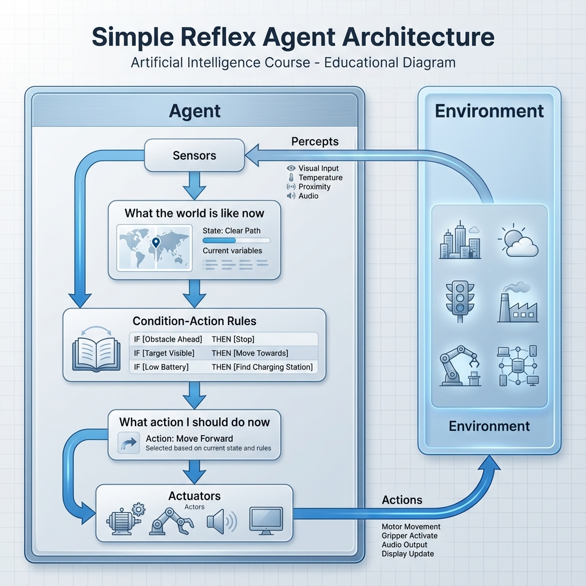
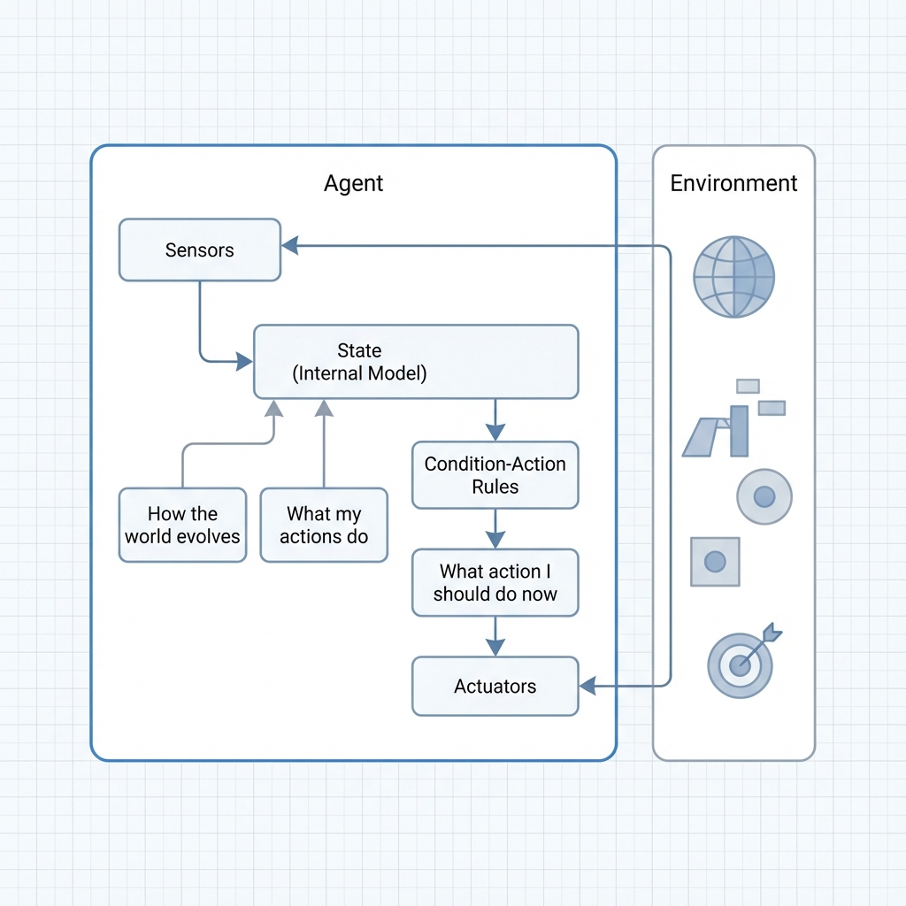
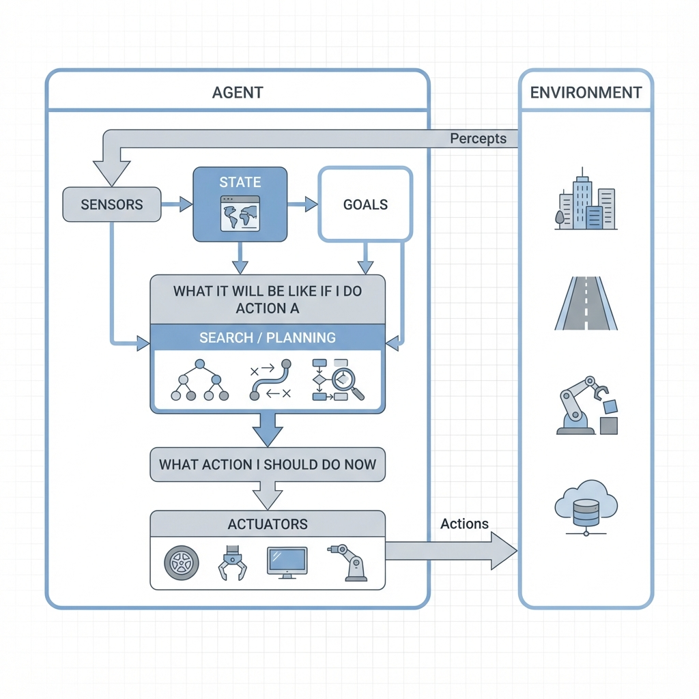
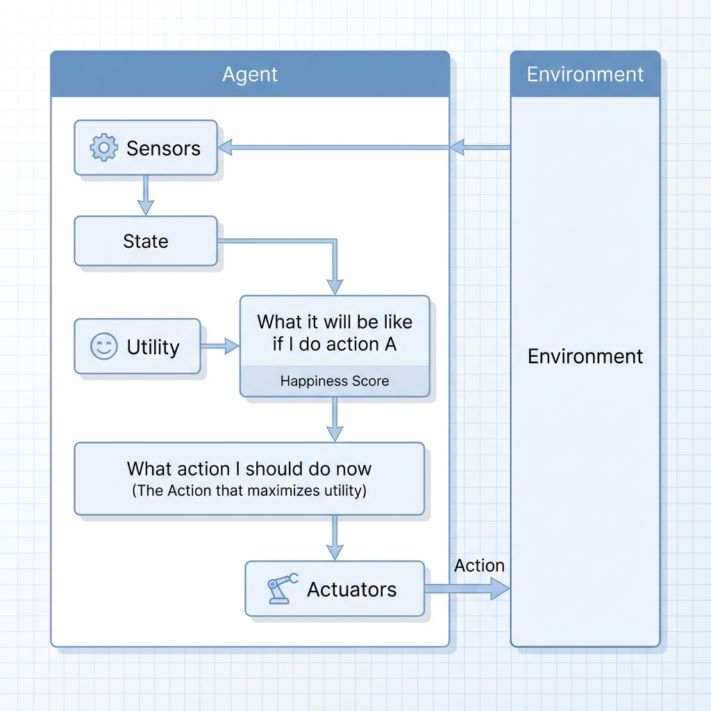

# 🎓 Introduction to Artificial Intelligence: A Comprehensive Course

Welcome to the **Foundations of AI** course. This repository is structured as a progressive learning journey, covering everything from the philosophical origins of "Thinking Machines" to the complex architectures of modern autonomous agents.

---

## 🏛️ Module 1: The Philosophical & Logical Foundations

In this module, we explore the fundamental question: _What does it mean for a machine to be intelligent?_ We categorize AI not just by what it does, but by how it perceives and reasons.

### 1.1 The Four Pillars of AI

We distinguish AI systems based on their objective and their methodology across two axes: **Human vs. Rational** and **Thought vs. Action**.

- **Human-Centric Approach:**
  - **Thinking Humanly:** The study of human cognition. We use computational models to mimic the brain's internal processes.
  - **Acting Humanly:** The behaviorist approach. This is defined by the **Turing Test**, where a machine's success is measured by its ability to be indistinguishable from a human.
- **Rational-Centric Approach:**
  - **Thinking Rationally:** The "Laws of Thought." Using formal logic and syllogisms to reach undeniable conclusions.
  - **Acting Rationally:** The **Rational Agent** approach. A system that acts to achieve the best outcome (or best expected outcome) given its information.

---

## 🔬 Module 2: Intelligent Agents & Environments

Intelligence is not just about calculation; it is about **interaction**. This module focuses on the **Agent-Environment loop**.

### 2.1 The Anatomy of an Agent (PEAS)

When designing an AI, we must first define its operational "universe" using the PEAS framework:

- **Performance (P):** What are the success metrics?
- **Environment (E):** Where does the agent operate?
- **Actuators (A):** How does the agent impact the world?
- **Sensors (S):** How does the agent perceive the world?

### 2.2 Environmental Characteristics

Understanding the "stage" where the agent acts is crucial for algorithm selection:

- **Fully vs. Partially Observable:** Does the agent see everything?
- **Deterministic vs. Stochastic:** Is the next state predictable?
- **Static vs. Dynamic:** Does the world change while the agent thinks?

---

## 🏗️ Module 3: Architectures of Intelligence

We progress from simple reactive systems to complex agents capable of foresight and learning.

### 3.1 Simple Reflex Agents

The most basic form of AI, operating entirely in the "here and now." These agents choose actions based exclusively on the current percept, ignoring the rest of the percept history.

#### Architecture Logic Flow

Following the fundamental design, the process follows a linear, reactive path:

1.  **Sensors:** Receive raw data from the **Environment**.
2.  **What the world is like now:** The agent processes the sensor data to understand its immediate surroundings.
3.  **Condition-Action Rules:** The agent consults its internal "rule-base" (If-Then statements).
4.  **What action I should do now:** A specific action is selected based on the matching rule.
5.  **Actuators (Actors):** The physical or digital tools that execute the action back onto the Environment.

_Architecture Flow showing the transition from Environment perception to Actuator response via Condition-Action Rules._

- **Mechanism:** "If [Condition] then [Action]."
- **Key Limitation:** These agents are only successful if the environment is **Fully Observable**. Without memory, they cannot handle "hidden" parts of the world.

### 3.2 Model-Based Reflex Agents

Evolution begins here. These agents overcome the limitations of a partially observable environment by maintaining an **Internal State** (a "Model" of the world).

#### The Power of Memory & Prediction

Unlike the simple reflex agent, this architecture tracks parts of the world it cannot currently see. The "Internal State" is updated based on:

1.  **How the world evolves:** The physical or logical rules of the environment (e.g., if a car is moving, its position will change even if obscured).
2.  **How the agent's actions affect the world:** Predicting the result of its own movement or intervention.

#### Architecture Logic Flow

1.  **Sensors:** Receive data from the **Environment**.
2.  **State (Internal Model):** The agent combines current sensor data with knowledge of how the world evolves and the consequences of its previous actions to update its "Internal State."
3.  **Condition-Action Rules:** Decisions are made based on this comprehensive state, rather than just raw sensor data.
4.  **Actuators:** Execute the chosen action.

_The Model-Based architecture introduces a feedback loop between the agent's actions and its internal understanding of the world._

### 3.3 Goal-Based Agents

As we move toward higher-level intelligence, the agent's behavior shifts from reactive "rules" to proactive "planning." Goal-based agents act to achieve a specific future state or **Goal**.

#### The Concept of Foresight

Unlike reflex agents, a Goal-Based agent asks: _"What will happen if I do action A? Will it bring me closer to my goal?"_ This requires:

1.  **Search & Planning:** Evaluating sequences of actions to find a path to the goal.
2.  **State Prediction:** Projecting current state into the future based on potential actions.

#### Architecture Logic Flow

1.  **Sensors:** Perceive the current **Environment**.
2.  **State:** Updates the internal model of the world (like a Model-Based agent).
3.  **Goals:** Provides the destination or the desired state.
4.  **Planning/Search:** The agent evaluates how the world would change if it performed various actions, selecting the sequence that fulfills the goal.
5.  **Actuators:** Execute the first action in the planned sequence.

_Goal-Based architecture introduces "Search and Planning," allowing the agent to evaluate future outcomes before taking action._

### 3.4 Utility-Based Agents

The peak of sophistication in decision-making. While Goal-based agents focus on a binary "success" state, Utility-based agents ask: _"How well can I achieve my objectives?"_

#### The Concept of Preference & Quality

A **Utility Function** maps a state (or sequence of states) onto a real number, which describes the "degree of happiness" or performance quality. This allows the agent to:

1.  **Select the Optimal Path:** When multiple paths lead to a goal, it chooses the one with the highest utility (e.g., fastest or safest).
2.  **Handle Conflicting Goals:** It can make rational trade-offs when goals conflict (e.g., speed vs. fuel efficiency).

#### Architecture Logic Flow

1.  **Sensors & State:** Perceive the environment and maintain the internal model.
2.  **What it will be like if I do action A:** The agent predicts future states.
3.  **Utility Function:** The agent assigns a "Happiness Score" to each predicted future state.
4.  **Action Selection:** The agent chooses the action that **Maximizes Expected Utility**.
5.  **Actuators:** Execute the chosen optimal action.

_Utility-Based architecture introduces the "Utility Function," allowing the agent to quantify preferences and make complex trade-offs._

### 3.5 Learning Agents

The self-improving system.

- _Concept:_ Consists of a **Learning Element** (improvement), **Performance Element** (action), **Critic** (feedback), and **Problem Generator** (exploration).

---

## 📖 Glossary of Course Terms

- **Agent Function:** The mathematical mapping from a percept sequence to an action.
- **Rationality:** The property of an agent that acts so as to maximize its performance measure.
- **Omniscience:** Knowing the actual outcome of actions (Impossible in the real world, unlike Rationality).

---

_Stay tuned for Module 4: Search Algorithms and Problem Solving..._
